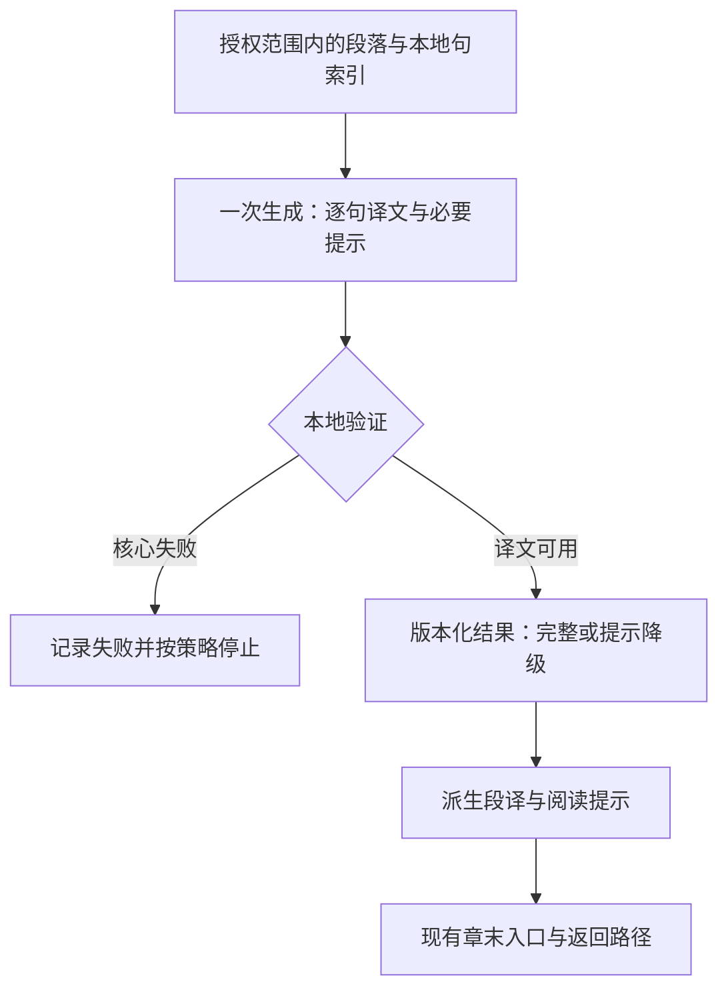

# 阅读辅助改造：技术方案与实施顺序

日期：2026-08-28。工作分支：`codex/reading-comprehension-redesign`。
初稿状态：仅方案；初稿轮核对代码，没有实施改造、调用模型或生成新的 EPUB。
实施更新：P0 已完成技术验收；P1 的纯文本代码和离线 mock 验证已落地，真实模型对照与
路径选择已完成；P2 的冻结结果渲染与 EPUBCheck 集成验证已完成；P3 的自动化退出条件已完成，
Calibre/AZW3 一次性兼容性测试已执行、Paperwhite 人工验收待执行；P4 已完成布局对照、有界邻段语境、自动定向复核、
正文短语链接实验和 GLM effort 对照，真实同句 Stanza A/B 因本机模型资源缺失保留为环境边界。
见 [P0/P1 验收](reading-p0-p1-audit.md) 与 [项目说明](../PROJECT.md)。下文保留原阶段计划。

本文是后续实施顺序、数据契约和技术验收的主入口，取代此前设计文档中的实施草案。
产品目标、容错原则与历史教训见 [阅读辅助设计](reading-comprehension-redesign-plan.md)；
既有运行结果见 [项目说明](../PROJECT.md)。
Fable 的建议来自用户提供的回答，作为设计输入，不作为经过本项目验证的研究结论。

## 1. 推荐范围

**先做“共享句译＋按需阅读提示”的单次生成实验，沿用章末单向入口；验证后再接入章节转换。
短语、句子、段落是提示的作用范围，不是三套必填栏目，也不是三次模型调用。**

| 取舍 | 首版决定 | 理由 |
| --- | --- | --- |
| 短语释义 | 支持，先显示在章末辅助区 | 填补整句翻译过重的情况；无需改写正文词语所在的 XHTML 节点 |
| 句子提示 | 允许只显示共享句译、只解释或两者结合 | 解决实际障碍，不为每张卡再生成独立 meaning |
| 段落衔接提示 | 可选，仅解释当前段落有证据的关系 | 不写每段摘要；跨段时间／视角变化需要更多证据，后置处理 |
| 段落译文 | 保留；正文不显示，打开辅助后直接可见 | 现状已是按需进入，不增加“先看提示才能看译文”的门槛 |
| 生成调用 | 一次主要生成作为首选候选；保留双阶段对照 | 降低编排复杂度，但不预先认定质量最好或费用减半 |
| 正文词级弹窗、折叠、额外标记 | 首版不做 | 混合 XHTML 定位、Kindle 脚注识别和返回路径会扩大风险 |
| 练习、自检、复述、复习任务 | 不纳入 | 阅读本身就是使用过程，没有附加作业 |
| Stanza、模型档位、多模型升级 | 首轮固定既有条件，之后分别比较 | 避免把内容结构、调用策略与模型参数同时改变 |

首版保留完整译文兜底，重点改变额外帮助的内容与共享方式。是否调整辅助页内的展示
顺序，后续使用同批冻结输出比较，不与模型质量实验混在一起。

## 2. 当前实现与改造成本

以下基于本轮读取的工作树。成本是相对工程复杂度，包含测试，不是工期承诺。

| 当前实现 | 改造落点 | 复杂度 |
| --- | --- | --- |
| `analyze_paragraph` 固定 fast → quality；后者只收候选句，没有完整段落或初稿 | 保留旧入口，新增显式实验路径；复用 `complete_json(system, user)` | 中 |
| `_parse_sentence_translations` 立即拼接字符串；`ParagraphLearning` 不保存句译映射 | 新结果保留逐句译文，由程序派生段译 | 中：涉及解析、缓存、渲染，而非只改 prompt |
| `LearningCard` 固定 `sentence/difficulty/meaning`；额外字段会被丢弃 | 新增独立的阅读辅助数据契约，不把解释塞入旧 meaning | 中 |
| `apply_note` 已支持段末单向链接、章末段译和原句卡 | 复用入口和容器，增加新结果渲染分支 | 中低；新排版仍需实机验收 |
| `Sentence` 只有索引和原文，没有 XHTML 字符位置 | 首版在辅助区引用原句／短语，不做正文词级定位 | 低于内联弹窗；后者为高复杂度 |
| `LearningCache` 保存 JSON payload，但旧反序列化无新契约版本 | 增加 payload 版本与生成身份；保留旧缓存读取路径 | 中，无需先改 SQLite 表结构 |
| 本地门控可完全跳过段落；40 词规则还会删除部分句卡 | 新路径的译文覆盖与提示选择分开，短提示不经过旧长句过滤 | 中；同时影响调用量 |
| `analyze_paragraph_with_retries` 在质量失败时可能重跑整个两阶段 | 新路径独立区分核心译文失败与可选提示失败 | 中，避免为了坏提示重做有效译文 |
| CLI 估算、进度和 usage 围绕两个客户端组织 | 按实际调用计划计数，更新 dry-run、累计用量与停止逻辑 | 中，不能仅少调用 quality 而保留旧估算 |

代码入口：[生成与解析](../translator/translator.py)、[EPUB 渲染](../translator/epub_processor.py)、
[缓存](../translator/cache.py)、[CLI](../translator/cli.py)、[提示词](../translator/languages.py)、
[trace](../translator/trace.py)、[分句与门控](../translator/sentence_analyzer.py)。

客户端目前使用通用 object 响应格式；包括名为 `json_schema` 的路径，也没有声明完整
业务字段约束。因此可先复用传输客户端，但新契约仍必须由本地验证，不能把“能解析 JSON”
当成“字段与索引都正确”。首版不扩建供应商框架或为多个模型分别开发新路径。

## 3. 读者实际看到什么

原书正文仍仅增加段末 `›`。点击后直接进入当前段落的辅助区：

1. 可读的段译，来自同一份句级译文。
2. 有需要时，显示指向具体英文的短语释义、句子提示或段落衔接提示；空内容不显示栏目。
3. 使用 Kindle 阅读历史返回原位置，没有答题、强制重读或译文解锁步骤。

提示默认简短，但不以固定“一至三行”作为程序拒收条件。模型以解决当前障碍为目标；
本地只做安全长度上限和确定性去重。不得截断否定或限定来满足显示长度。
句子提示需要完整句译时引用已有译文；展示上的重复可以为了原句对照保留，计算上的
重复翻译则避免。若只是换一种中文措辞，不算新增帮助。

**首版短语释义的限制：**它位于章末辅助区，引用对应短语；不能直接点击正文中的词
弹出解释。这样先验证内容价值，再决定是否值得支付词级定位和阅读器兼容成本。
当前弹窗试错与单向返回证据见 [实机记录](../COMPATIBILITY.md#paperwhite-手动验收产物)。

### 离线兜底与覆盖范围

“按需”指读者按需查看，模型在制作 EPUB 时提前生成。首版不让 Kindle 点击触发 API。

新路径在所选章节内，默认对现有正文识别器支持的所有段落准备译文，复用
`--local-gate off` 的行为；提示仍选择性生成。标题、诗歌、表格、原书脚注等既有排除项
不因此扩大处理。未选择的章节也没有新增辅助。

旧路径继续沿用自己的门控默认值。新 CLI 须区分未指定门控与用户显式选择：新路径
未指定时取 off；若用户主动开启跳过，dry-run 与结果报告明确“跳过段落无译文兜底”。
完整覆盖会增加相对旧门控的段落数和段末入口数量，必须重新估算，不能在相同预算下
暗中扩大范围。这是可靠兜底的代价；若选择更少入口和请求，就明确接受部分段落无辅助。

## 4. 最小数据契约

建议新增小型 `translator/reading_assistance.py`，放新结果类型、验证和序列化；生成流程
仍由 `translator.py` 调用。新类型不依赖 EPUB DOM，便于纯文本验证；不先拆分整个项目。
下面的类型名为拟议接口，当前尚不存在。

| 记录 | 最少内容 | 约束 |
| --- | --- | --- |
| `ParagraphAssistance` | 本地写入的 `schema_version`、输入／分句身份、`sentences`、`aids`、诊断状态 | 版本与来源由程序绑定，不由模型声明自己已验证 |
| `SentenceReading` | `index`、`translation`、`difficulty` | 每个源句恰好一次；原文从本地句表取，段译按索引拼接 |
| `ReadingAid` | `scope`、`sentence_indices`、可选 `quote`、可选 `text`、`show_translation` | 按下面规则验证；不是每句都要有 aid |

`scope` 仅有 phrase、sentence、paragraph 三种，用于定位与展示，不是语法知识分类。

- **phrase：**绑定一个句索引；`quote` 是该句中唯一匹配的原文片段，`text` 为语境释义。
- **sentence：**绑定一个句索引；`show_translation=true` 时显示共享句译；有 `text` 时
  显示阅读提示。两者至少有一个，允许两者同时使用。
- **paragraph：**`sentence_indices` 指出当前段落内的证据句，`text` 说明实际衔接关系；
  不自动附全段原文或再写一份完整翻译。

索引排除布尔值，所有枚举和字段类型显式校验。短语定位只允许精确子串；重名短语、
无匹配或跨句 quote 不猜位置，该条标记无效并保留诊断。首版不让模型计算字符偏移，
不做模糊匹配，也不拼接“英文主干”。若以后支持内联定位，再单独增加 DOM 映射。

模型只返回 `sentences` 与 `aids`；输入段落、原文句表、身份、实际 usage、失败与修订来源
由程序保存。`difficulty` 供诊断和辅助程度参考，不作为删除短语或段落提示的硬开关；
即便各句单独看都简单，段落关系也可能需要提示。首版无需模型自报 confidence。

### 验证与失败处理

| 情况 | 处理 |
| --- | --- |
| 非法 JSON、核心句译缺失、重复／越界索引 | 核心结果失败；保留原始响应，按本轮重试策略停止或重试，不冒充成功 |
| 句译完整，某条提示无法定位／字段无效 | 丢弃该提示，保留译文与其他有效提示；记录 `partial_aids`，不为此自动重译整段 |
| 句译完整但提示集合无法解析 | 保存 `translation_only` 状态与异常；区别于合法空数组，不报告完整提示生成成功 |
| `aids=[]` 合法，确实无需额外帮助 | 正常结果；开发集另查是否漏选，不凭零提示认定质量最好 |
| 无害生硬、局部冗余或可疑语气 | 按设计文档的容错分级评估，不把全部语义疑点做成硬校验 |

降级状态进入运行报告；保留的译文可用于阅读，但不掩盖缺失提示。缓存读取保持该状态，
不会因重跑命令悄悄重试所有已完成段落。任何后续补做须显式选择并计入预算。
模型文本经现有 XML 文本接口转义，不作为 HTML 或链接执行。

## 5. 调用结构、成本与缓存

首版不增加自动语义复核、置信度 router 或强弱模型级联。单次生成会同时处理译文、
困难判断和提示，可能出现任务相互干扰；在纯文本阶段与两阶段候选比较后再决定默认。
语境先限当前段落及已授权的必要元数据；既有读者画像可以复用，无需新增校准任务。

公平对照使用相同最终契约：单次直接产出结果；两阶段先译，再把原文与初稿一起交给
第二阶段，返回完整最终句译和提示。首轮第二阶段返回完整结果，不先开发局部修订协议。
两者共用语义规则、输入原文范围、Stanza 证据、模型／档位和指定输出要求；初稿是
两阶段的额外中间结果，如实记录，不能声称只改变了一个 prompt 变量。
旧 fast/quality 输出保留为历史基线，不能靠丢弃新提示字段来伪装等价任务。

### 请求量与用量

设新覆盖范围内有 N 个段落；旧门控后有 M 个段落，其中 K 个进入 quality：

- 旧路径正常调用量是 M + K，不一定是 2M。
- 新单次路径正常调用量是 N；同范围双阶段实验至多 2N。
- 如以后增加 R 次定向复核，新路径为 N + R；全部 transport／schema 重试另计。

N 可能大于 M；单次输出也会变长，所以请求少不等于 token 少，更不等于质量更好。
`estimate_translation` 需按选定路径、覆盖范围及重试预留重新估算；实际费用、延迟和
reasoning 用量以供应商响应记录为准，不把未返回的费用记为零。

首次付费对照建议 2 个短段落、单次与两阶段各一次，共最多 6 次请求，自动重试为 0。
继续到 8 段时总计最多 24 次，不重复已完成样本。8 个开发段落之外另留 8 段模型验收
样例；数量可随预算调整。这是开发测试，读者不用答题或标注整套样本。
这些数字只是提案；外发文本、endpoint、当前可用模型参数、输入预留、每次输出上限和
总 token／费用上限必须执行前另行确认。首轮串行，不继承历史充值或运行余额。

运行用量累计应覆盖实际参与的所有客户端、失败请求与 `prior_tokens`；切换到单次后
不能漏计或重复计费。当前实际 token 停止检查依赖 `_ConsoleProgress` 的两客户端汇总，
必须随新路径改造。新增调用前检查剩余预留；已有在途请求仍可能消耗，估算与请求后
检查不等于供应商级硬扣费上限。大范围并发前再验证在途预留和停止行为。

### 缓存与重放

- 新 payload 明确版本，生成指纹包含 pipeline、业务契约、system/user 模板、分句版本、
  输入语境、模型请求策略、Stanza 身份及影响生成的辅助程度；不包含 API key。
- 旧缓存仅由旧路径读取。没有句译映射的旧段译不按中文标点拆回索引；首版不做自动迁移。
- 新内容记录不与视觉布局绑定。同批结果可以在本地重渲染为新的输出文件，不触发模型；
  布局版本记录在产物报告，单纯改排版不使生成缓存失效。
- 复用 `TraceRun`／`ParagraphTrace` 的请求、原始响应、usage 与脱敏机制，增加新阶段名和
  契约版本。现有 `quality-replay` 保留历史协议，新实验入口独立，避免伪造旧 trace 身份。

## 6. 实施顺序与退出条件

每步独立提交、独立验收。下列命令名与类型均为拟议接口；此文不表示它们已能运行。

### P0：修复会干扰比较的缺陷

在现有测试中复现并修复：布尔索引、非有限 confidence、数字子串漏检、`as if` 跨句误拦。
数字检查比较独立数字项与明确允许的规范化，不能用 `12 in 112` 代替保留检查。
旧路径的 `as if` 检查先限定到对应原句，保留既有同句回归。新路径中，句内“目的”等
关键词不足以证明捏造，只作为待审风险，不把旧关键词硬拦规则搬到新提示文本。

新实验 prompt 的公共语义规则单处维护，指令用英文；对照两阶段不再一边保留全部
亲属词、一边只保留歧义词。旧 v2/v6 精确文本与历史结果不覆盖，新规则另立版本。
通用解析 bug 可以修复旧执行路径，但必须标明新代码版本，不能冒充历史复现。

**出口：**新增复现用例变绿、原有契约测试通过；旧 prompt 快照完整，尚未改变读者结构。

### P1：打通纯文本生成与新契约

实现数据类型、校验、序列化，以及独立的纯文本实验入口（拟名 `reading-eval`）。
支持单次与两阶段候选；复用现有客户端、分句、trace 与冻结 Stanza 证据。
先用 mock 验证完整路径，再按授权运行上述小样本；此阶段不接 EPUB 或生产缓存。

测试覆盖短语唯一匹配／重名／跨格式提取后的文本、句注三种组合、段落证据索引、
合法空帮助、无效提示的降级、核心失败，以及全部调用与用量记录。
生成专项固定需要帮助的位置；正常选择另测，包含短习语、长插入、否定条件、语气、
跨句指代和简单段落。保留原始与筛选后结果，避免“全判 fluent”掩盖遗漏。

**出口：**两种调用路径能返回同一种可验证结果；样例中的成功、失败、重复提示、遗漏
和真实用量可对照。选定首版路径或明确待解决问题，尚不声称 Kindle 阅读收益已验证。

### P2：接入现有渲染，验证阅读结构

在 `ParagraphNote`／`apply_note` 边界增加新结果适配与明确的渲染分支；保持旧卡片路径。
不把新辅助硬转成 `meaning`，也不要求旧字段测试接受新 schema。先用冻结结果制作本地
页面，再经已有 EPUB 流程生成明确标记的预览；预览不自动触发新的模型请求。

首版只新增辅助区内容，正文仍是一个段末入口；复用源文件不覆盖、原书脚注隔离、
唯一 ID、文本／结构快照、差异 EPUBCheck 和 ZIP 校验。测试 `<em>`、链接、原书脚注、
重复短语及长提示，确保源文和原有样式没有被新锚点破坏。

**出口：**合成 EPUB 2/3 的正文、链接与脚注检查通过；Calibre/AZW3 后在 Paperwhite
确认辅助区可读、无误弹窗且返回准确。实机未测时明确标“待实机验收”。用户只需正常
阅读并自愿反馈是否更好读，不需要解释语法或完成题目。

### P3：接入 CLI、缓存与章节运行

拟新增 `--pipeline legacy|reading-v1`，验收前仍默认 legacy；新路径显式启用。
让 preview、translate、dry-run 使用同一解析后的调用配置，避免预览与正式运行分叉。
新路径默认完整覆盖支持的段落；已有 `--local-gate` 可显式改为跳过，报告缺失兜底。
辅助程度作为软偏好，不复用旧 40 词门槛或 `_apply_density` 对新 aid 的整批删除逻辑。

接入版本化缓存、从冻结结果重渲染、调用估算、实际用量、取消和续跑。首轮章节运行
串行；两阶段候选若胜出，要确保第二次失败不会无记录地重复已完成的第一阶段。
缓存完整结果与可用降级结果，失败原件单独留 trace，不写成完整成功缓存。

**出口：**mock 验证缓存命中零调用、旧／新隔离、只改布局零调用、核心失败续跑、提示
降级保留、预算停止及旧路径回退；再按新授权完成小章节实跑和费用／恢复对账。
仅在用户接受阅读体验后切换默认。回退采用 legacy 与旧缓存生成新文件，不覆盖旧产物。

### P4：有证据后再做的独立扩展

| 扩展 | 何时值得做 | 复杂度／额外约束 |
| --- | --- | --- |
| 有／无 Stanza、不同 effort 或模型 | 新结构可用，但解析或推理开销明显 | 中；独立对照并重新核对供应商参数 |
| 原文＋初稿的定向复核 | 持续存在可指出的关键错误，复核确实改善 | 中高；保存修订来源、同步全部视图、重算缓存与预算，检查未升级样本 |
| 有界邻段语境 | 当前段落不足以解释真实卡点 | 中高；先限同章一个前段和输入 token 上限，显式区分上下文与目标；输入身份含邻段 hash，先确认外发范围 |
| 辅助页中译文与提示的顺序 | 用户觉得现有布局阻碍原文对照 | 中低；同批输出离线比较，不要求额外点击才获得译文 |
| 正文词级链接／短释义弹窗 | 内容已证实有用，而章末跳转仍是主要负担 | 高；独立解决混合文本节点定位、原书链接冲突和 Kindle 弹窗吞内容问题 |

这些扩展不阻塞首版。段落理解可用当前段落开始，不能凭书名记忆补写跨段人物关系；
也不因想支持时间跳转就先建设整章摘要、人物图谱或长期阅读追踪系统。

实施更新：`preview --pipeline reading-v1 --reading-layout translation-first|aids-first`
已经可以从同一份冻结 manifest 或缓存结果离线生成对照 EPUB。默认仍为
`translation-first`，不会影响既有产物或触发模型调用；`aids-first` 仅改变辅助页中
提示与段译节点的展示次序，供后续人工阅读比较。

## 7. 测试落点与交付判断

优先扩展现有测试，不另起重复框架：

| 文件 | 本次实施需要补的覆盖 |
| --- | --- |
| `tests/test_learning.py` | 四类解析问题、新契约与降级、共享句译、候选路径、缓存／续跑及源句绑定 |
| `tests/test_prompt_composition.py`、`tests/test_sentence_meaning_contract.py` | 保持旧契约；新指令覆盖段落证据、公共规则、允许无提示且不要求练习 |
| `tests/test_cli.py`、`tests/test_tuning_profiles.py` | 新路径显式选择、门控默认解析、preview/translate 配置一致、用量／预算与版本指纹 |
| `tests/test_epub_processor.py` | 新辅助渲染、XML 转义、无效定位不挂错句、原书脚注与 DOM 保留 |
| 现有 EPUBCheck、Calibre、真实 EPUB 集成测试 | 新输出的 EPUB 2/3、AZW3 导航和原资源保留；实机观察独立记录 |

技术通过、模型样例通过、真实阅读有帮助分别报告。语言能力提升不作为本轮验收任务。
若语义反复误导、原书受损、导航回退或费用无法对账，则不扩大运行；个别不影响理解的
瑕疵按既定容错原则记录。方案文档完成不等于任何 P0–P4 已完成。

本轮不提交或改动私人书籍、缓存和凭据；也不接管工作区已有的模型配置与测试改动。
当前 P0 已验收；下一步确认 P1 小样本真实对照的文本、模型与预算授权，
无需先实现弹窗或自动复核系统。
